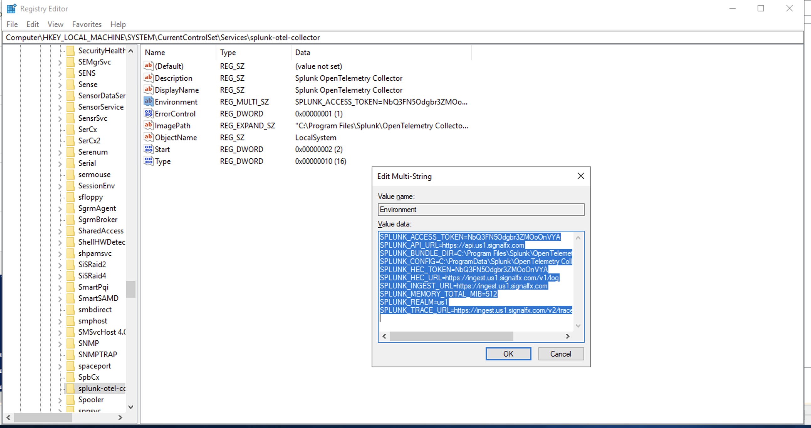

# Instrumentation Tutorial with Spring PetClinic Sample Application


## 1. Understanding the Spring Petclinic application with a few diagrams
<a href="https://speakerdeck.com/michaelisvy/spring-petclinic-sample-application">See the presentation here</a>

## 2. Build PetClinic Package
PetClinic is a [Spring Boot](https://spring.io/guides/gs/spring-boot) application built using [Maven](https://spring.io/guides/gs/maven/) or [Gradle](https://spring.io/guides/gs/gradle/). You can build a jar file and run it from the command line (it should work just as well with Java 11 or newer):


Download and Install spring-petclinic application
```cmd
git clone https://github.com/spring-projects/spring-petclinic.git
```

```cmd
cd spring-petclinic
.\mvnw package -Dmaven.test.skip
```

Build artifact are built is target/spring-petclinic-{version}-SNAPSHOT.jar 

## 3. Download Open Telemetry Java Instrumentation 

Execute the followig powershell script to download the Otel Java Instrumentation file (splunk-otel-javaagent.jar)
```cmd
Invoke-WebRequest -Uri https://github.com/signalfx/splunk-otel-java/releases/latest/download/splunk-otel-javaagent.jar -OutFile splunk-otel-javaagent.jar
```

## 4. Run PetClinic Application (locally on Windows) with OpenTelemetry APM Instrumentation

Create a startup script

```cmd
notepad start-app.cmd
```

Copy and paste the following contents into the **start-app**.cmd file

```cmd
set OTEL_SERVICE_NAME=petclinic
set OTEL_RESOURCE_ATTRIBUTES=deployment.environment=dev,version=1.1.0
set OTEL_EXPORTER_OTLP_ENDPOINT=http://localhost:4318

set JAVA_OPTIONS="-javaagent:.\splunk-otel-javaagent.jar"

java %JAVA_OPTIONS% -jar .\target\spring-petclinic-3.4.0-SNAPSHOT.jar
```

Execute start-app.cmd

```cmd
start-app.cmd
```

You can then access petclinic here: http://localhost:8080/

## 5. Enable Browser (Real User Monitoring) Instrumentation

The Spring PetClinic application uses a single HTML page as the "layout" page, that is reused across all pages of the
application. This is the perfect location to insert the Splunk RUM Instrumentation Library as it will be loaded in all
pages automatically

Let’s then edit the layout page:

```cmd
notepad src\main\resources\templates\fragments\layout.html
```

Paste the below snippet within the HTML **head** section after all the **meta** tags
```javascript
<script src="https://cdn.signalfx.com/o11y-gdi-rum/latest/splunk-otel-web.js" crossorigin="anonymous"></script>
<script>
    SplunkRum.init({
        realm: "us1",
        rumAccessToken: "REPLACE_WITH_YOUR RUM_TOKEN",
        applicationName: "petclinic",
        deploymentEnvironment: "dev"
    });
</script>
```

Rebuild the deployment jar file and then restart the **start-app.cmd**

```cmd
.\mvnw package -Dmaven.test.skip
```

# Appendix

## A. Update the Open Telemetry Collector configuration to export application logs

The Collector configuration is a YAML file  which specifies the behavior of the different components and services. By default, it’s stored in C:\ProgramData\Splunk\OpenTelemetry Collector\agent_config.yaml.

The HEC export configuration is defined in the snippet below

```
splunk_hec:
token: "${SPLUNK_HEC_TOKEN}"
endpoint: "${SPLUNK_HEC_URL}"
source: "otel"
sourcetype: "otel"
index: "main"
profiling_data_enabled: false
```

Instead of updating environment variables directly in the configuration file (although you can if you want to), based on the specified installation parameters for MSI installer, the environment variables are sourced from the following registry key

Registry Key Path:
```
HKLM:\SYSTEM\CurrentControlSet\Services\splunk-otel-collector .
```

Registry Key Name:
```
Environment
```

Registry Key Values:

```properties
SPLUNK_HEC_URL=
SPLUNK_HEC_TOKEN=
```



Restart splunk-otel-collector service for changes to take effect.


## B. Create Docker Image

Create the Dockerfile from the snippet below

```properties
FROM openjdk:17

EXPOSE 8080

# Adds the latest version of the Splunk Java agent
ADD --chown=javauser:javauser https://github.com/signalfx/splunk-otel-java/releases/latest/download/splunk-otel-javaagent.jar /opt/splunk-otel-javaagent.jar

WORKDIR /app

COPY ./spring-petclinic/target/spring-petclinic-3.4.0-SNAPSHOT.jar /app/petclinic.jar

ENTRYPOINT [ "java", "-javaagent:/opt/splunk-otel-javaagent.jar",  "-jar","/app/petclinic.jar"]
```

Always re-build the PetClinic package to ensure you have the latest build with all the source code changes built in

```cmd
.\mvnw package -Dmaven.test.skip
```

Execute the following command to build the image
```cmd
docker build -t petclinic-app . -f Dockerfile
```

## C. Create and Run PetClinic Docker Container

```cmd
docker run --name petclinic -d -p 8080:8080 petclinic-app:latest -e OTEL_SERVICE_NAME="petclinic" -e OTEL_RESOURCE_ATTRIBUTES"deployment.environment=dev" -e OTEL_EXPORTER_OTLP_ENDPOINT="http://host.docker.internal:4318" 
```